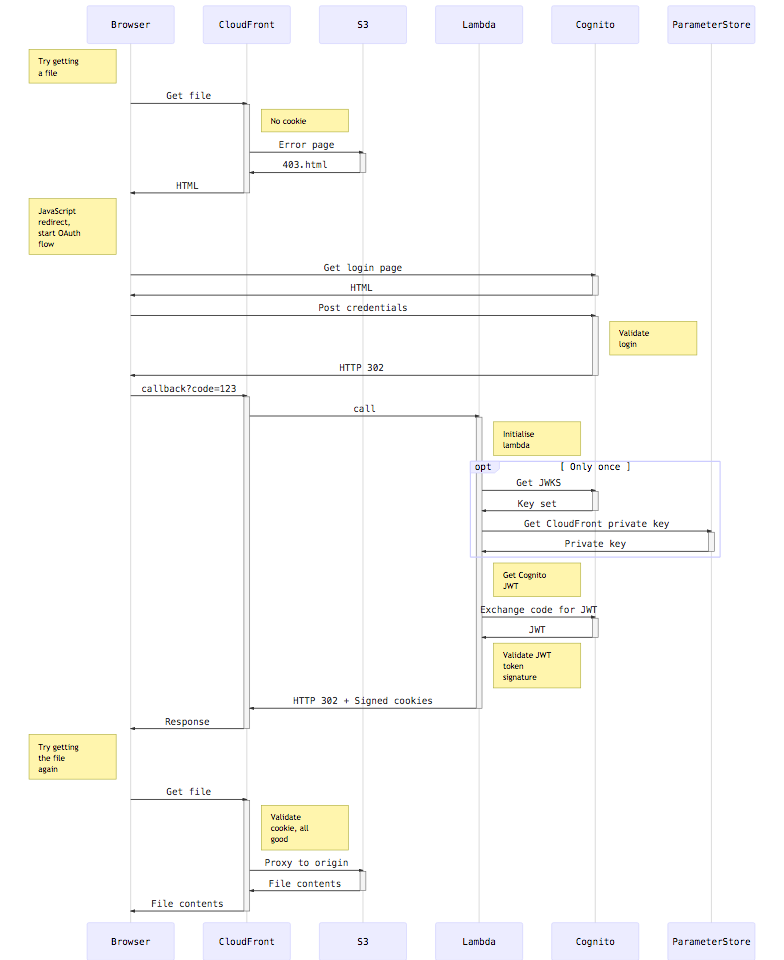
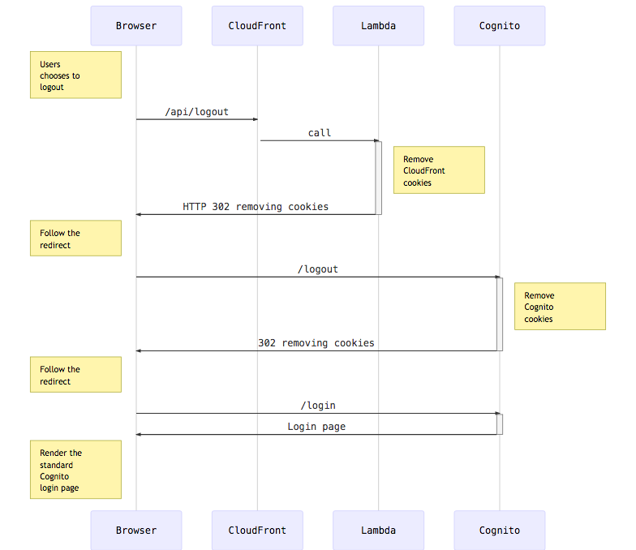

# Technical design

There are 4 main components involved.

- [S3 bucket](https://aws.amazon.com/s3) to store the website (HTML, CSS, media...)
- [CloudFront](https://aws.amazon.com/cloudfront) to provide caching and edge-authentication
- [Cognito](https://aws.amazon.com/cognito) to manage users and authentication
- [Lambda](https://aws.amazon.com/lambda) to validate Cognito tokens and create [CloudFront signed cookies](http://docs.aws.amazon.com/AmazonCloudFront/latest/DeveloperGuide/private-content-signed-cookies.html)

## Login flow

## Logout flow

